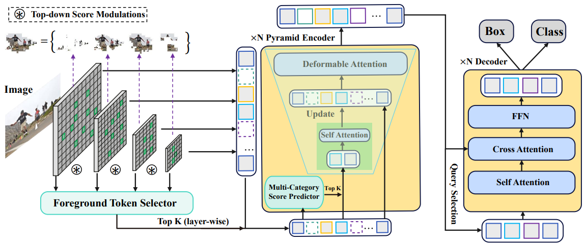

# Contents

- [Contents](#contents)
    - [Focus-DETR Description](#focus-detr-description)
    - [Model architecture](#model-architecture)
    - [Dataset](#dataset)
    - [Environment Requirements](#environment-requirements)
    - [Eval process](#eval-process)
        - [Usage](#usage)
        - [Launch](#launch)
        - [Result](#result)
    - [ModelZoo Homepage](#modelzoo-homepage)

## [Focus-DETR Description](#contents)

Focus-DETR is a model that focuses attention on more informative tokens for a better trade-off between computation efficiency and model accuracy. Compared with the state-of-the-art sparse transformed-based detector under the same setting,
our Focus-DETR gets comparable complexity while achieving 50.4AP (+2.2) on COCO.

> [Paper](https://openreview.net/pdf?id=iuW96ssPQX): Less is More: Focus Attention for Efficient DETR.
> Dehua Zheng*,  Wenhui Dong*, Hailin Hu, Xinghao Chen, Yunhe Wang.

## [Model architecture](#contents)

Our Focus-DETR comprises a backbone network, a Transformer encoder, and a Transformer decoder. We design a foreground token selector (FTS) based on top-down score modulations across multi-scale features. And the selected tokens by a multi-category score predictor and foreground tokens go through the Pyramid Encoder to remedy the limitation of deformable attention in distant information mixing.



## [Dataset](#contents)

Dataset used: [COCO2017](https://cocodataset.org/#download)

- Dataset size：~19G
    - [Train](http://images.cocodataset.org/zips/train2017.zip) - 18G，118000 images
    - [Val](http://images.cocodataset.org/zips/val2017.zip) - 1G，5000 images
    - [Annotations](http://images.cocodataset.org/annotations/annotations_trainval2017.zip) -
      241M，instances，captions，person_keypoints etc
- Data format：image and json files
    - The directory structure is as follows:

```text
.
├── annotations  # annotation jsons
├── test2017  # test data
├── train2017  # train dataset
└── val2017  # val dataset
```

## [Environment Requirements](#contents)

- Hardware(GPU)
    - Prepare hardware environment with GPU.
- Framework
    - [MindSpore](https://www.mindspore.cn/install/en)
- For more information, please check the resources below£º
    - [MindSpore Tutorials](https://www.mindspore.cn/tutorials/en/master/index.html)
    - [MindSpore Python API](https://www.mindspore.cn/docs/en/master/index.html)

## [Eval process](#contents)

### Usage

After installing MindSpore via the official website, you can start evaluation as follows:

### Launch

```bash
# infer example python
bash scripts/DINO_eval_ms_coco.sh /path/to/your/COCODIR /path/to/your/checkpoint
# bash scripts/DINO_eval_ms_coco.sh coco2017 ./logs/best_ckpt.ckpt
```

checkpoint can be downloaded at https://download.mindspore.cn/model_zoo/research/cv/Focus-DETR/.

### Result

```bash
Results of Focus-DETR with Resnet50 backbone:
IoU metric: bbox
 Average Precision  (AP) @[ IoU=0.50:0.95 | area=   all | maxDets=100 ] = 0.479
 Average Precision  (AP) @[ IoU=0.50      | area=   all | maxDets=100 ] = 0.659
 Average Precision  (AP) @[ IoU=0.75      | area=   all | maxDets=100 ] = 0.521
 Average Precision  (AP) @[ IoU=0.50:0.95 | area= small | maxDets=100 ] = 0.323
 Average Precision  (AP) @[ IoU=0.50:0.95 | area=medium | maxDets=100 ] = 0.505
 Average Precision  (AP) @[ IoU=0.50:0.95 | area= large | maxDets=100 ] = 0.619
 Average Recall     (AR) @[ IoU=0.50:0.95 | area=   all | maxDets=  1 ] = 0.372
 Average Recall     (AR) @[ IoU=0.50:0.95 | area=   all | maxDets= 10 ] = 0.640
 Average Recall     (AR) @[ IoU=0.50:0.95 | area=   all | maxDets=100 ] = 0.720
 Average Recall     (AR) @[ IoU=0.50:0.95 | area= small | maxDets=100 ] = 0.568
 Average Recall     (AR) @[ IoU=0.50:0.95 | area=medium | maxDets=100 ] = 0.757
 Average Recall     (AR) @[ IoU=0.50:0.95 | area= large | maxDets=100 ] = 0.878
```

## [ModelZoo Homepage](#contents)

Please check the official [homepage](https://gitee.com/mindspore/models).
